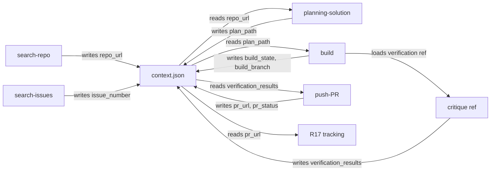

## Goal Capsule

- **Objective:** Build a standalone AI agent plugin that guides developer-adjacent contributors through the full open-source contribution pipeline — from finding repos and issues through planning, building, critiquing, and shipping PRs — encoding non-slop process discipline into every skill. V1 ships on Claude Code; cross-platform expansion and god-mode autonomy are deferred to v2.
- **Product Authority:** This brainstorm defines product scope, user behavior, skill boundaries, and success criteria. Implementation detail (skill internals, platform adapter mechanics, state format) belongs in planning.
- **Open Blockers:** None remaining. All blocking questions resolved during brainstorm and review.
- **Execution Profile:** Implementation via ce-work or goal-mode. Plugin scaffolding first, then skills in dependency order, then integration test.
- **Tail Ownership:** ce-work owns implementation; ce-code-review owns pre-merge review.

---

## Product Contract

### Summary

Vibe Contributer is a standalone plugin for Claude Code that encodes the "AI as junior engineer you manage carefully" methodology into structured skills. It guides developer-adjacent contributors — people comfortable with git, CLI tools, and AI agents but not with reading or writing code — through finding actively maintained repos with good first-issue labels, identifying workable issues, planning solutions against contributing guidelines, building with embedded verification gates, critiquing through a multi-stage external-verification pipeline, and shipping PRs. Cross-platform expansion and god-mode autonomous operation are deferred to v2 after single-platform validation confirms maintainer acceptance and merge rates.

### Problem Frame

Non-coders who want to contribute to open source face a process problem, not a capability problem. AI coding agents can write code, but without structured workflow discipline the output is slop: vague one-shot prompts, no context feeding, no verification, no iteration. The pattern is "AI as vending machine" — accept the first output and push it.

Matt Van Horn's contribution history (100+ merged PRs across Python, Go, OpenCV, uutils/coreutils, pypa/hatch, and dozens more) demonstrates that the non-slop pattern is process, not coding ability: feed the agent real context, break asks into verifiable steps, run the code, use the agent adversarially against itself, treat CI and tests as ground truth, and sanity-check diff scope even without reading code line by line. The skill that matters is product/process judgment — knowing how to specify a problem clearly and verify an answer without deep domain expertise.

The bottleneck is repetition: every session, the non-coder re-explains the entire workflow to the agent. A skill encodes that process once. The plugin's durable value is the methodology, not the capability — as agents improve natively at coding, the structured workflow wrapper remains the differentiator.

### Key Decisions

- **Fully self-contained, no CE runtime dependency.** The plugin carries its own planning, build, and review logic inspired by compound-engineering patterns but never invokes CE skills at runtime. This avoids installation friction and keeps the plugin portable, at the cost of more skill content to maintain internally.

- **Approach B: Guided Workflow with Embedded Safety Gates.** Skills share a lightweight contribution context that flows between them. Verification is structural, not optional — the build skill runs its critique verification pipeline before returning, and push-PR checks that verification evidence exists before proceeding. This was chosen over fully independent skills (too loose, doesn't prevent slop) and over a full session lifecycle (too rigid, platform-fragile).

- **Critique is both standalone and embedded.** Critique exists as a separate skill invokable on any diff, any branch, any PR — and also runs as a verification phase inside build and god-mode. This satisfies the dual requirement: ad-hoc audit capability and mandatory in-flow verification.

- **God-mode runs autonomously through the pipeline with a human confirmation gate before push.** God-mode executes search, planning, build, and embedded critique without human checkpoints, then pauses to present the PR draft (plan summary, diff scope, verification results, self-critique findings) and requires explicit user approval before pushing. This preserves the autonomy benefit (no manual step-by-step orchestration) while adding human judgment at the only irreversible action — a public PR to a repo the user does not own. The self-critique gate alone cannot substitute for human judgment because the same LLM reviewing its own work shares systematic blindspots.

- **Language-agnostic with maintenance and first-issue filtering.** Search scans all of GitHub but filters for repos with good first-issue labels, active maintenance, and contributor guidelines. This naturally surfaces repos that want outside contributions and have the infrastructure to handle them.

- **Single-platform validation first; cross-platform adapters deferred to v2.** Ship the Claude Code adapter for v1, validate the full 7-skill pipeline end-to-end on real contributions, then port to Codex, Cursor, and Hermes Agent in v2 once the skill content is stable. Cursor in particular lacks a native skill concept equivalent to the others, making the thin-wrapper pattern non-trivial there.

### Requirements

**Discovery**

- R1. The search-repo skill searches GitHub for actively maintained open-source repositories that accept outside contributions, filtering for signals of contributor-friendliness (good first-issue labels, CONTRIBUTING.md, active commit activity, open issues with recent maintainer engagement).

- R2. The search-issues skill scans a selected repository's open issues for ones a non-coder could meaningfully work on with an agent — prioritizing labeled issues (good first issue, help wanted, documentation), recently active issues, and issues with clear acceptance criteria or maintainer guidance.

**Planning**

- R3. The planning-solution skill reads the selected issue, the repository's contributing guidelines, and enough of the codebase to propose a detailed fix scoped to the issue. The plan must reference existing code patterns and conventions so the proposed solution aligns with how the project already works.

- R4. The planning-solution skill produces its plan in a format the non-coder can evaluate without reading code — describing what the fix does, why this approach, what files it touches, and what the verification plan is.

**Building**

- R5. The build skill implements the planned solution, following the contributing guidelines and existing code patterns identified during planning.

- R6. The build skill runs an embedded verification pipeline before returning: execute existing tests, run linters/formatters if the project has them, check diff scope is reasonable (focused, not touching unrelated files), and produce a structured self-critique covering correctness, edge cases, style, and scope. The build is not "done" until verification evidence exists.

**Critique**

- R7. The critique skill is invokable standalone on any branch, diff, or PR — it does not require a contribution context to have been built through the pipeline.

- R8. The critique skill runs a multi-stage verification pipeline: local tests as external ground truth (and CI results when available on an existing PR, e.g., in standalone critique per F3), diff scope and PR convention checks (conventional commit format, focused diff, matches existing patterns), and a structured self-review with written output covering specific dimensions (correctness, edge cases, style, scope) that a non-coder can read and judge. Embedded critique in build/god-mode (R9) substitutes local test execution for CI since no PR exists yet; god-mode may push a draft PR to obtain CI results, then re-run critique before converting to ready-for-review.

- R9. When critique runs inside build or god-mode, it uses the same verification pipeline but its output feeds the next gate rather than requiring human interpretation.

**Shipping**

- R10. The push-PR skill verifies that critique/verification evidence exists before proceeding. If no evidence is found, it refuses to push and directs the user to run critique first.

- R11. The push-PR skill writes a detailed PR description that a non-coder would write: what issue it addresses, what the fix does (in functional terms), how it was verified, and any trade-offs or areas the maintainer should review closely.

**Autonomy**

- R12. The god-mode skill runs the pipeline autonomously — search-repo, search-issues, planning-solution, build (with embedded critique) — then pauses to present the PR draft for human approval before push-PR. No human checkpoint during the pipeline run; one human confirmation before the irreversible push action.

- R13. God-mode's internal safety gates must all pass before push: tests pass, linters clean, diff scope reasonable, structured self-critique completed with no unresolved critical findings. If any gate fails, god-mode iterates on the fix before retrying, up to a defined iteration limit.

**Cross-Platform**

- R14. The plugin ships a platform adapter for Claude Code in v1, using the platform's native plugin/skill format. Cross-platform expansion to Codex, Cursor, and Hermes Agent is deferred to v2 after single-platform validation. Skill content is platform-agnostic; adapters handle format and tool-availability differences.

- R15. Each skill degrades gracefully when platform-specific tools are unavailable (e.g., no GitHub API access, no local test runner). The skill reports what it cannot do rather than failing silently.

**Shared Context**

- R16. A lightweight contribution context flows between skills, accumulating state: selected repo, selected issue, plan, build state, verification results. This eliminates the need to re-explain context between skills — the core pain point this plugin solves.

**Post-PR Tracking**

- R17. After push-PR, the plugin monitors PR status (open/merged/closed/changes-requested) and feeds results back into the contribution context so the user can see outcomes and the process can learn from rejections. Success is measured at PR-merged, not PR-opened.

### Key Flows

- F1. Guided contribution flow
  - **Trigger:** User invokes search-repo to start a new contribution.
  - **Actors:** Non-coder user, AI agent.
  - **Steps:** search-repo narrows repos → user selects a repo → search-issues narrows issues → user selects an issue → planning-solution produces a plan → user reviews the plan → build implements with embedded verification → critique runs (embedded or standalone) → push-PR ships with verification evidence.
  - **Outcome:** A PR is opened against the target repo with verification evidence and a non-coder-readable description. Post-push, R17 tracks PR status toward merge.
  - **Covered by:** R1–R11, R14–R16.

- F2. God-mode autonomous flow
  - **Trigger:** User invokes god-mode.
  - **Actors:** AI agent (no human checkpoints).
  - **Steps:** search-repo selects a repo → search-issues selects an issue → planning-solution produces a plan → build implements with embedded critique → all safety gates checked → if any gate fails, iterate (up to limit) → push-PR ships with verification evidence.
  - **Outcome:** A PR is opened autonomously, or the pipeline reports it could not satisfy all gates within the iteration limit.
  - **Covered by:** R1–R13, R14–R16.

- F3. Standalone critique flow
  - **Trigger:** User invokes critique on any branch, diff, or PR — no contribution context required.
  - **Actors:** Non-coder user, AI agent.
  - **Steps:** critique runs the multi-stage verification pipeline on the current diff → produces a structured written report covering correctness, edge cases, style, scope, and test/CI results.
  - **Outcome:** A non-coder-readable critique report the user can use to decide whether to push, iterate, or abandon.
  - **Covered by:** R7, R8, R14.

### Scope Boundaries

**Deferred for later:**

- God-mode (R12-R13) — deferred to v2. Ship v1 with the guided flow only (R1–R11), validate that guided-flow PRs are accepted and merged by maintainers, then introduce god-mode with configurable autonomy levels once verification gates have proven rigor against real maintainer feedback.
- Automated maintainer communication and PR review feedback response — push-PR writes the description, but responding to reviewer comments is manual for v1.
- Configurable autonomy levels (user-settable checkpoints in god-mode) — ships alongside god-mode in v2.
- User profile/reputation tracking (suggesting repos based on past merged PRs, building a contributor history).
- Multi-PR batching (working on several issues in parallel).

**Outside this product's identity:**

- Code-reading assistance or code education features — the user is assumed comfortable not reading code. The plugin substitutes process for code literacy, not teaching code literacy.
- Dependency on compound-engineering plugin — Vibe Contributer is self-contained at runtime. CE is a design inspiration, not a prerequisite.
- In-repo development workflow (working on a project you own) — the plugin is specifically for contributing to repos the user does not own.

### Dependencies / Assumptions

- The user has `gh` CLI authenticated and available — the plugin uses GitHub API for repo/issue search and PR creation.
- The user has a working local development environment for the target repo's language (the build skill needs to run tests and linters).
- The AI agent platform supports file read/write, shell execution, and HTTP/API calls. Platforms lacking any of these will have degraded behavior on the corresponding skills.
- The plugin assumes GitHub as the only hosting platform for v1. GitLab/Bitbucket support is deferred.

### Outstanding Questions

**Resolved:**

- O1. Contribution context is a JSON file (e.g., `.vibe-contributer/context.json`) in the target repo's working directory. Structured fields (`repo_url`, `issue_number`, `plan_path`, `build_state`, `verification_results`) let each skill read what it needs and write what it produces. Non-coders don't need to read it — the skills produce human-readable output alongside.

- O2. Skills are platform-agnostic, following CE's pattern: a single `skills/` directory holds all skill content as markdown `SKILL.md` files. Platform adapter directories (`.claude-plugin`, `.codex-plugin`, `.cursor-plugin`, `.agents`) contain only thin `plugin.json` metadata wrappers that point to the shared skills directory. No runtime platform detection.

**Deferred to Planning:**

- O3. How many iterations does god-mode attempt before giving up on a failing gate? What's the default and is it configurable?

- O4. Should search-repo prioritize repos the user has starred or previously contributed to, or always search fresh?

- O5. How does the build skill handle repos with no test suite or no linter? What's the degraded verification pipeline?

**From Document Review (Round 1):**

- O6. Self-contained CE reimplementation cost justification — the plugin carries its own planning/build/review logic internally rather than depending on CE at runtime. Is the maintenance cost of duplicating CE patterns justified, or should the plugin consider an optional CE-aware mode? (scope-guardian)

- O7. "Durable value" premise — the plan assumes agents improve at coding but not at workflow orchestration. If agents natively encode process discipline within 12-18 months, what is the plugin's competitive moat? (product-lens)

- O8. Maintainer reception — what is the expected PR merge rate for AI-generated contributions from developer-adjacent users, and has this been validated against real maintainer sentiment data? (product-lens)

### Sources / Research

- Matt Van Horn's GitHub profile (github.com/mvanhorn): 100+ merged PRs across Python (CPython), Go, OpenCV, uutils/coreutils, pypa/hatch, rubygems, thunderbird, Vercel, and dozens more. Pull Shark x4 badge. PRs follow conventional-commit format, tackle real bugs (type errors, edge cases, platform compatibility). Demonstrates that non-coder contribution at scale is achievable with process discipline.

- Compound Engineering plugin (github.com/EveryInc/compound-engineering-plugin, 22k stars): 27 skills following brainstorm → plan → work → simplify → review → compound loop. Multi-platform adapter structure (`.claude-plugin`, `.codex-plugin`, `.cursor-plugin`, `.agents`, `.opencode`, `.pi`, `.agy`, `.kimi-plugin`). Plugin.json schema, skill format, and workflow loop are the design reference for Vibe Contributer's structure.

- Existing `vibe-coding` skill at `~/.agents/skills/vibe-coding/`: lightweight coaching skill for non-technical builders. Not a contribution pipeline — a starting point for the philosophy, not the implementation.

---

## Planning Contract

### Key Technical Decisions

- **KTD-1: Plugin structure follows CE's pattern.** A single `skills/` directory holds all skill content as `SKILL.md` files. A `.claude-plugin/` directory holds the plugin manifest (`plugin.json`) and marketplace metadata. Root-level `AGENTS.md` provides canonical repo instructions; `CLAUDE.md` is a one-line `@AGENTS.md` redirect. This mirrors the proven CE structure and simplifies future cross-platform expansion — v2 adds adapter directories without touching skill content.

- **KTD-2: Contribution context is a JSON file at `.vibe-contributer/context.json`.** Fields: `repo_url`, `issue_number`, `issue_title`, `plan_path`, `build_state`, `build_branch`, `verification_results`, `pr_url`, `pr_status`. Each skill reads the fields it needs and writes the fields it produces. The file lives in the target repo's working directory (the cloned fork), not in the plugin directory — it is per-contribution state, not plugin state.

- **KTD-3: Each skill is a SKILL.md file with a `references/` subdirectory.** The SKILL.md carries YAML frontmatter (`name`, `description`, `argument-hint`) and the workflow instructions. The `references/` directory holds supporting docs loaded on demand — verification checklists, GitHub API query templates, PR description templates, contributing-guideline checklists. This follows CE's pattern of lazy-loading reference material.

- **KTD-4: No converter CLI for v1.** CE ships a TypeScript CLI (`src/`) that converts the Claude plugin format to other platform formats. Vibe Contributer does not need this for v1 — only one platform adapter is shipped. If v2 adds platforms, the converter can be built then or CE's converter can be forked.

- **KTD-5: Skills use `gh` CLI for GitHub operations, not direct API calls.** The `gh` CLI is already assumed to be authenticated (Dependencies/Assumptions). Using `gh` instead of raw API calls keeps skills simpler and avoids token management. Skills that need GitHub data (search-repo, search-issues, push-PR, R17 tracking) shell out to `gh`.

- **KTD-6: Verification pipeline is defined in a shared reference, not per-skill.** The critique verification checklist (tests, linters, diff scope, structured self-critique dimensions) lives in `skills/critique/references/verification-pipeline.md`. The build skill's embedded critique loads this same reference. This ensures the embedded and standalone critique use identical criteria.

- **KTD-7: God-mode is deferred but its skill scaffold is included.** The `skills/god-mode/SKILL.md` file exists in v1 with a stub that says "coming in v2 — use the guided flow (search-repo → search-issues → planning-solution → build → critique → push-PR) for now." This prevents users from hitting a missing-skill error and documents the future intent.

### High-Level Technical Design

The plugin's architecture is a pipeline of independent skills connected by a shared JSON context file:



Each skill is a standalone SKILL.md that reads `context.json` on entry and writes its outputs back before exiting. The critique skill loads the shared `verification-pipeline.md` reference whether invoked standalone or embedded in build.

### Assumptions

- The user has `gh` CLI authenticated and on their PATH.
- The user has cloned the target repo locally and can run its test/lint commands.
- Claude Code's skill invocation mechanism works with the `.claude-plugin/` directory structure (following CE's proven pattern).
- The target repo has either a test suite, a linter, or both. When neither exists, the verification pipeline degrades to diff-scope + self-critique only (O5).
- GitHub search API rate limits are sufficient for the search-repo and search-issues skills' query patterns.

### Sequencing

Implementation follows dependency order: scaffolding first, then skills that earlier skills depend on, then the integration test. God-mode stub is last since it depends on all other skills existing.

---

## Implementation Units

### Output Structure

```text
vibe-contributer/
├── plugin.json
├── .claude-plugin/
│   └── plugin.json
├── AGENTS.md
├── CLAUDE.md
├── README.md
├── LICENSE
├── skills/
│   ├── search-repo/
│   │   ├── SKILL.md
│   │   └── references/
│   │       └── repo-search-filters.md
│   ├── search-issues/
│   │   ├── SKILL.md
│   │   └── references/
│   │       └── issue-search-filters.md
│   ├── planning-solution/
│   │   ├── SKILL.md
│   │   └── references/
│   │       ├── contributing-guideline-checklist.md
│   │       └── plan-template.md
│   ├── build/
│   │   ├── SKILL.md
│   │   └── references/
│   │       └── build-verification.md
│   ├── critique/
│   │   ├── SKILL.md
│   │   └── references/
│   │       └── verification-pipeline.md
│   ├── push-PR/
│   │   ├── SKILL.md
│   │   └── references/
│   │       └── pr-description-template.md
│   └── god-mode/
│       └── SKILL.md
└── docs/
    └── plans/
```

### U1. Plugin scaffolding

- **Goal:** Create the plugin directory structure, manifest files, and root-level docs.
- **Requirements:** R14
- **Dependencies:** None
- **Files:** `plugin.json`, `.claude-plugin/plugin.json`, `AGENTS.md`, `CLAUDE.md`, `README.md`, `LICENSE`
- **Approach:** Create the root `plugin.json` (minimal: name, version, description). Create `.claude-plugin/plugin.json` with the richer manifest including `skills: "./skills/"`, `interface` block, and metadata. Write `AGENTS.md` with plugin conventions, skill naming rules (`vibe-` prefix), and the contribution context convention. `CLAUDE.md` is one line: `@AGENTS.md`. `README.md` documents the plugin's purpose, installation, and the 7-skill workflow. `LICENSE` is MIT.
- **Patterns to follow:** CE's `.claude-plugin/plugin.json` structure, `AGENTS.md` as canonical instruction file, `CLAUDE.md` as redirect.
- **Test expectation:** none — scaffolding and config, no behavioral code.
- **Verification:** Plugin directory structure matches the Output Structure tree. `.claude-plugin/plugin.json` is valid JSON with `skills` pointing to `./skills/`. `AGENTS.md` exists and is non-empty.

### U2. search-repo skill

- **Goal:** Create the search-repo skill that finds contributor-friendly GitHub repositories.
- **Requirements:** R1, R15, R16
- **Dependencies:** U1
- **Files:** `skills/search-repo/SKILL.md`, `skills/search-repo/references/repo-search-filters.md`
- **Approach:** SKILL.md frontmatter: `name: search-repo`, `description: Find actively maintained open-source repos worth contributing to.`, `argument-hint: "[optional: language or topic filter]"`. The skill uses `gh search repos` with filters for: stars >100, has `good first issue` label, updated within last 30 days, has `CONTRIBUTING.md`. The reference file documents the exact `gh` query patterns and the contributor-friendliness signals. On completion, writes `repo_url` and `repo_name` to `.vibe-contributer/context.json`.
- **Patterns to follow:** CE's SKILL.md frontmatter format, `references/` for lazy-loaded docs.
- **Test scenarios:**
  - Happy path: `gh search repos` returns results with `good first issue` labels — skill presents them to the user for selection.
  - No results: filters are too narrow — skill widens search or reports "no repos match, try relaxing filters."
  - `gh` not authenticated — skill reports the error and directs user to run `gh auth login` (R15 graceful degradation).
- **Verification:** Skill produces a repo selection and writes `repo_url` to context.json.

### U3. search-issues skill

- **Goal:** Create the search-issues skill that finds workable issues in a selected repo.
- **Requirements:** R2, R15, R16
- **Dependencies:** U1, U2
- **Files:** `skills/search-issues/SKILL.md`, `skills/search-issues/references/issue-search-filters.md`
- **Approach:** SKILL.md reads `repo_url` from context.json. Uses `gh issue list` with filters for: `good first issue`, `help wanted`, `documentation` labels, recently updated, open state. The reference file documents which labels to prioritize and how to identify issues with clear acceptance criteria. Presents issues to the user with title, labels, and a summary of the issue body. On completion, writes `issue_number` and `issue_title` to context.json.
- **Test scenarios:**
  - Happy path: repo has labeled issues — skill presents them for selection.
  - No labeled issues: skill falls back to searching open issues with recent activity and clear descriptions.
  - Repo URL not in context.json — skill directs user to run search-repo first.
- **Verification:** Skill produces an issue selection and writes `issue_number` to context.json.

### U4. planning-solution skill

- **Goal:** Create the planning-solution skill that reads the issue and codebase, then proposes a plan.
- **Requirements:** R3, R4, R15, R16
- **Dependencies:** U1, U3
- **Files:** `skills/planning-solution/SKILL.md`, `skills/planning-solution/references/contributing-guideline-checklist.md`, `skills/planning-solution/references/plan-template.md`
- **Approach:** SKILL.md reads `repo_url` and `issue_number` from context.json. Uses `gh issue view` to read the issue body and comments. Reads `CONTRIBUTING.md` if it exists. Scans the codebase for patterns (file structure, naming conventions, test conventions). Produces a plan document using the plan-template.md reference: what the fix does, why this approach, what files it touches, what the verification plan is. The plan is written in functional terms a non-coder can evaluate. Writes `plan_path` to context.json.
- **Test scenarios:**
  - Happy path: issue is a bug with clear steps to reproduce — skill reads codebase and proposes a fix plan.
  - Issue is vague or lacks acceptance criteria — skill notes this and proposes its best interpretation, flagging the ambiguity.
  - No CONTRIBUTING.md — skill proceeds with general OSS conventions and notes the absence.
  - Issue references files that don't exist in the codebase — skill reports the mismatch.
- **Verification:** Plan document exists, is readable by a non-coder, references existing code patterns, and `plan_path` is in context.json.

### U5. build skill

- **Goal:** Create the build skill that implements the plan and runs embedded verification.
- **Requirements:** R5, R6, R9, R15, R16
- **Dependencies:** U1, U4
- **Files:** `skills/build/SKILL.md`, `skills/build/references/build-verification.md`
- **Approach:** SKILL.md reads `plan_path` from context.json. Implements the fix following the plan and contributing guidelines. After implementation, loads the shared verification pipeline from `skills/critique/references/verification-pipeline.md` and runs it: execute existing tests, run linters/formatters if present, check diff scope is focused, produce structured self-critique. Writes `build_state` (success/failed), `build_branch`, and `verification_results` to context.json. The build is not "done" until verification evidence exists.
- **Patterns to follow:** CE's ce-work skill structure — read plan, implement, verify.
- **Test scenarios:**
  - Happy path: plan is clear, tests pass, linters clean — skill reports success with verification evidence.
  - Tests fail after implementation — skill reports failures and attempts to fix them.
  - No test suite in target repo — skill runs diff-scope check and self-critique only (O5 degraded pipeline).
  - Diff touches 40+ files — skill flags this as a red flag and asks the user to review.
  - Build fails due to missing dependencies — skill reports the error and suggests setup steps.
- **Verification:** Build completes, `build_state` in context.json is `success`, `verification_results` contains test results and self-critique output.

### U6. critique skill

- **Goal:** Create the critique skill with the shared verification pipeline — both standalone and embedded.
- **Requirements:** R7, R8, R9, R15, R16
- **Dependencies:** U1
- **Files:** `skills/critique/SKILL.md`, `skills/critique/references/verification-pipeline.md`
- **Approach:** SKILL.md frontmatter: `name: critique`, `description: Analyze, critique, and verify a diff or PR against the non-slop verification pipeline.`. Invokable standalone (no context.json required) or embedded in build (R9). The `verification-pipeline.md` reference defines the multi-stage pipeline: (1) local tests as ground truth, (2) CI results when available on an existing PR, (3) diff scope checks (focused, conventional commit format, matches existing patterns), (4) structured self-review covering correctness, edge cases, style, scope. Output is a written report a non-coder can read and judge. When embedded in build/god-mode, output feeds the next gate rather than requiring human interpretation.
- **Test scenarios:**
  - Standalone on existing branch: skill runs verification pipeline on current diff and produces a report.
  - Standalone on existing PR: skill reads CI results via `gh pr checks` and includes them in the report.
  - Embedded in build: skill runs verification pipeline and returns pass/fail + evidence to build skill.
  - No tests, no linter in repo: skill degrades to diff-scope + self-critique only (O5).
  - Self-critique finds a critical issue: skill flags it as unresolved and reports it prominently.
- **Verification:** Critique produces a structured report with all applicable verification stages completed. `verification_results` written to context.json when embedded.

### U7. push-PR skill

- **Goal:** Create the push-PR skill that verifies evidence exists and ships the PR.
- **Requirements:** R10, R11, R15, R16, R17
- **Dependencies:** U1, U5, U6
- **Files:** `skills/push-PR/SKILL.md`, `skills/push-PR/references/pr-description-template.md`
- **Approach:** SKILL.md reads `verification_results` from context.json. If no evidence exists, refuses to push and directs user to run critique first (R10). Uses `gh pr create` with a PR description built from the pr-description-template.md reference: what issue it addresses, what the fix does in functional terms, how it was verified, trade-offs, and areas the maintainer should review closely. After push, writes `pr_url` and `pr_status` to context.json. Also starts R17 tracking — periodically checks PR status via `gh pr view --json state`.
- **Test scenarios:**
  - Happy path: verification evidence exists — skill creates a PR with a detailed description.
  - No verification evidence in context.json — skill refuses to push and directs user to run build or critique.
  - `gh pr create` fails (permissions, branch protection) — skill reports the error and suggests alternatives.
  - PR created successfully — skill writes `pr_url` and `pr_status: open` to context.json.
- **Verification:** PR is created on GitHub. `pr_url` in context.json is valid. PR description includes issue reference, functional description, verification evidence, and trade-offs.

### U8. god-mode stub + integration test

- **Goal:** Create the god-mode stub and write an integration test verifying the full pipeline flow.
- **Requirements:** R12, R13, R16
- **Dependencies:** U1, U2, U3, U4, U5, U6, U7
- **Files:** `skills/god-mode/SKILL.md`, `skills/god-mode/references/README.md`
- **Approach:** god-mode SKILL.md is a stub: "Coming in v2. Use the guided flow: search-repo → search-issues → planning-solution → build → critique → push-PR." The reference file documents the v2 plan including the human confirmation gate before push. Integration test verifies that all 7 skills exist with valid SKILL.md frontmatter, that the context.json schema is consistent across skills, and that the pipeline can be invoked sequentially without missing-dependency errors.
- **Test scenarios:**
  - All skills have valid YAML frontmatter with `name`, `description`, and `argument-hint`.
  - Context.json schema fields referenced by each skill are present in the schema definition.
  - god-mode stub reports "coming in v2" when invoked.
- **Verification:** All 7 skills exist with valid frontmatter. Context schema is consistent. Pipeline flow works end-to-end on a test repo.

---

## Verification Contract

| Gate | Command / Check | Applicable Units | Pass Signal |
|------|----------------|-----------------|-------------|
| Plugin structure | Verify `.claude-plugin/plugin.json` is valid JSON with `skills` key | U1 | JSON parses, `skills` points to `./skills/` |
| Skill frontmatter | Verify each `skills/*/SKILL.md` has valid YAML frontmatter | U2–U8 | All have `name`, `description`, `argument-hint` |
| Context schema | Verify `.vibe-contributer/context.json` fields are consistent across skills | U2–U8 | All referenced fields exist in the schema |
| Skill invocation | Invoke each skill in sequence on a test repo | U2–U7 | Each skill reads context, produces output, writes context |
| Critique pipeline | Run critique on a test diff | U6 | Report includes all applicable verification stages |
| Push-PR guard | Attempt push-PR without verification evidence | U7 | Skill refuses and directs user to run critique first |
| God-mode stub | Invoke god-mode | U8 | Reports "coming in v2" |

---

## Definition of Done

**Global:**
- All 8 implementation units complete with their verification gates passing.
- Plugin directory structure matches the Output Structure tree.
- All 7 skills (6 functional + 1 stub) have valid SKILL.md files with correct frontmatter.
- The contribution context JSON schema is consistent across all skills that read or write it.
- README.md documents installation, the 7-skill workflow, and the non-slop philosophy.
- AGENTS.md documents plugin conventions, skill naming rules, and context schema.
- No abandoned experimental code or dead-end scaffolding in the diff.

**Per-unit:**
- U1: Plugin scaffolding verified — manifests valid, root docs exist.
- U2: search-repo writes `repo_url` to context.json after user selects a repo.
- U3: search-issues writes `issue_number` to context.json after user selects an issue.
- U4: planning-solution writes `plan_path` to context.json after producing a non-coder-readable plan.
- U5: build writes `build_state` and `verification_results` to context.json after implementation + embedded verification.
- U6: critique produces a structured report with all applicable verification stages, standalone and embedded.
- U7: push-PR creates a PR on GitHub with a detailed description, writes `pr_url` to context.json, refuses without evidence.
- U8: god-mode stub reports "coming in v2"; integration test confirms all skills exist and pipeline flows.
